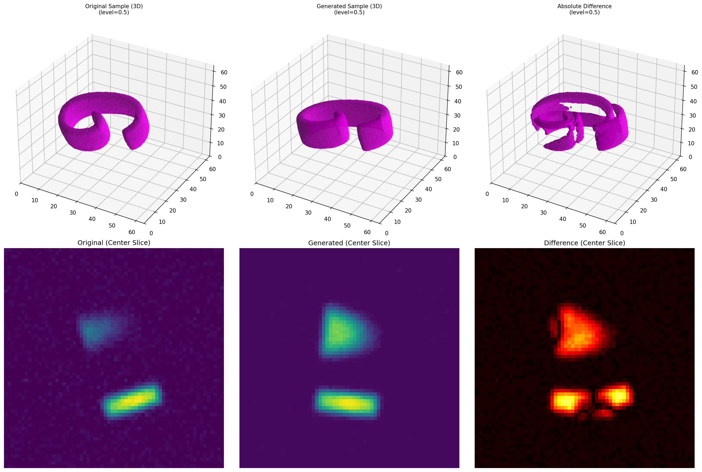

# 3D Shape Generation Through Voxel Diffusion

**A Denoising Diffusion Probabilistic Model (DDPM) for generating high-fidelity, smooth 3D Khmer numerals using continuous voxel density fields.**



*(Left: Procedural Ground Truth, Middle: Generated Diffusion Output, Right: Difference Map)*

## Overview

This project explores the intersection of **procedural modeling** and **generative deep learning**. Instead of relying on massive, hand-modeled 3D datasets, we train a diffusion model to mimic a procedural generation script. By operating on **Continuous Density Fields** rather than binary occupancy grids, our model learns to generate artifact-free, smooth 3D topology (loops, curves, and variable strokes) even at a modest resolution of $64^3$.

## Key Features

* **Voxel Density Fields**: Trains on continuous gradients (0.0–1.0) instead of binary voxels to capture sub-voxel surface details.
* **Two-Phase Curriculum Learning**:
  1. **Autoencoder Phase**: Pre-trains the U-Net for pure reconstruction ($t=0$) to learn the shape manifold.
  2. **Diffusion Phase**: Fine-tunes with a cosine noise schedule for robust denoising.
* **Procedural Supervision**: A custom pipeline that generates infinite training variations of Khmer numerals with random rotations, scaling, and shearing.
* **3D U-Net Architecture**: A specialized U-Net with sinusoidal time embeddings injected into every residual block for time-aware volumetric processing.

## Installation

1. **Clone the repository**

```bash
git clone https://github.com/yourusername/3d-voxel-diffusion.git
cd 3d-voxel-diffusion
```

2. **Install dependencies**

```bash
pip install torch numpy scipy matplotlib tqdm imageio wandb scikit-image
```

## 🛠️ Usage

### 1. Generate the Dataset

Create the procedural training data (3D density fields) from the font file.

```bash
python dataset/generate_dataset.py
```

**Output**: Saves `.npy` voxel grids to `data/khmer_numerals/train` and `val`.

**Config**: Adjust `VOXEL_SIZE` (default 64) in `src/config.py`.

### 2. Train the Model

Run the two-phase training loop (Autoencoder → Diffusion).

```bash
python train.py
```

**Logs**: Training progress is logged to Weights & Biases (WandB) and printed to console.

**Checkpoints**: Saved to `outputs/checkpoints/`.

### 3. Generate Samples (Inference)

Generate new 3D shapes from pure Gaussian noise using the trained model.

```bash
# Generate 5 samples using DDIM sampler
python inference.py --count 5 --sampler ddim --model_filename best_model.pth
```

**Arguments**:
- `--sampler`: Choose `ddim` (fast) or `ddpm` (accurate).
- `--autoencoder_only`: Skip diffusion to test reconstruction capabilities.

**Output**: Saves GIFs of the denoising process and 3D comparison plots to `outputs/samples/`.

## Results & Ablation

Our model achieves a validation reconstruction MSE of **0.00277**. We conducted an ablation study to optimize stability:

| Experiment | Learning Rate | Batch Size | Val Noise Loss | Stability |
|------------|---------------|------------|----------------|-----------|
| Ours (Baseline) | 1e-4 | 16 | 0.0807 | Stable |
| High LR | 1e-3 | 16 | 0.0919 | Unstable |
| Large Batch | 1e-4 | 32 | 0.0917 | Degraded |

**Batch Size 16** provided the best balance of gradient estimation and training stability.

## Project Structure

```
3d-voxel-diffusion/
├── dataset/
│   ├── generate_dataset.py     # Procedural generation pipeline
│   └── KantumruyPro.ttf         # Source font
├── src/
│   ├── model.py                 # 3D U-Net architecture
│   ├── config.py                # Hyperparameters & paths
│   ├── dataset.py               # PyTorch Dataset loader
│   └── utils.py                 # Diffusion schedules & helpers
├── train.py                     # Training loop (Curriculum learning)
├── inference.py                 # Sampling & Visualization script
└── README.md
```

## Citation

If you use this code for your research, please cite:

```bibtex
@article{vutha2025voxel,
  title={3D Shape Generation Through Voxel Diffusion},
  author={Chealyfey Vutha},
  year={2025}
}
```
